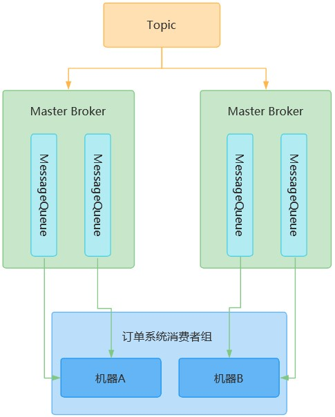

## 消费者原理

类似生产者原理，与NameServer建立TCP长连接，拉取路由信息，找到Topic在哪几个Broker上，建立长连接之后拉取消息

## Topic和消费者组的关系

每个Topic都是以消费者组为单位进行消费的，一个Topic可以被多个消费者组消费

即不同消费者组订阅了同一个Topic，那么Topic中的消息都会被每个消费者组获取到

一个消费者组可以包含若干个机器，比如订单服务部署了4台机器，这4个机器就属于同一个消费者组

## MessageQueue与消费者的关系

每个Topic上的多个MessageQueue，会均匀地将MessageQueue分配给消费者组的多台机器消费

有一个原则：一个MessageQueue只能给一个消费者组机器消费，一个消费者组机器可以消费多个MessageQueue

## 消费模式	

消费者组收到消息后，可以只给一个机器，也可以给所有机器

这里就有两种消费模式 —— 集群模式消费 & 广播模式消费

- 集群模式（默认）-- 消息只给一个机器消费

- 广播模式 -- 消息给所有机器消费，较少用到

  可通过consumer.setMessageModel(MessageModel.BROADCASTING);来配置

## Push模式 & Pull模式

这两个模式的本质都是消费者机器发请求到Broker机器拉取消息

不同点在于：

Push模式的实时性很好，Broker会尽可能实时地把新消息Push给消费者机器（本质还是消费者机器去发请求）

消费机器在处理完一批消息之后，立马发起请求拉取下一批消息，时效性非常好，看起来就像Broker不停地推送消息到消费者机器一样

##### Push模式的请求挂起和长轮询机制

- 请求挂起：当消费者机器发请求到Broker，Broker发现没有新的消息，就会让请求线程挂起，默认挂起15秒
- 长轮询：请求挂起期间，会有后台线程轮询检查是否有新消息到达，有就会主动唤醒挂起的线程， 返回新消息

## Broker如何读取消息给消费者

消费者机器关联着某个MessageQueue，发送拉取请求

然后到MessageQueue对应的ComsumeQueue文件中找到消费者机器下一个要消费的消息offset

然后去CommitLog找到这个offset地址的消息返回给消费者

## 消费者提交消费进度

消费者机器拉取到消息之后，会回调一个注册的函数

处理完消息之后，就会提交消费进度到Broker上去

`怎样才算处理完消息？没处理完就宕机咋办？处理完没提交offset就宕机咋办？`

Broker会以记录一个ConsumeOffset的形式，来记录消费者机器消费者机器对该MessageQueue的消费进度

下次就可以从Broker记录的消费位置开始拉取了