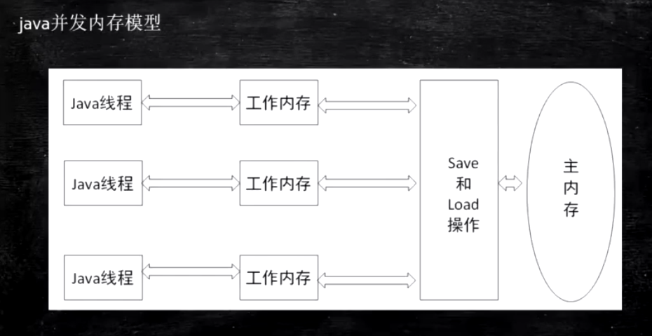

## Java内存模型

#### JMM的含义看书归纳



​													(图1)

#### JMM主要内容

> 如何支持高并发场景
>
> 对象new出来之后在内存怎么布局 


如图1，从主内存拿数据到工作内存，改完放回主内存，若使用volatile，内存屏障就是在主内存加


## 指令乱序问题

**DCL单例（双重检查锁）为什要加volatile**?

防止**指令重排**，否则引发半初始化问题
由于发生了指令重排，假如第一个线程给单例对象t分配内存后，先把内存引用赋值给声明的变量t，再执行对象初始化（正常情况是先初始化再把引用给t），这样对象初始化还没完成，第二个线程通过双重校验判断t已经不为null了，就会直接使用单例对象t，但他拿的是半初始化状态的t，如果直接使用t未初始化的成员变量，就会出现问题

乱序读：CPU为了**提高指令执行效率**，会在一条指令执行过程中，去同时执行下一条指令（比如去内存读数据，内存速度比CPU慢100倍），前提是两条指令没有依赖关系

乱序写：使用WCBuffer（write combining），比L1还快，一般只有4个字节，当CPU计算完要把结果写回缓存时，由于缓存速度慢，跟不上CPU计算速度，CPU会把多条指令的计算结果合并保存在WCBuffer，最后一次性更新写进缓存，而不是一条条写，这就是合并写技术。**093-02:05:00再看一遍，挺乱**

证明乱序的例子程序：093-02:20:00  


## 指令有序性保障

#### 硬件相关知识

- 现代CPU数据一致性=缓存锁（MESI等协议实现）+总线锁   **093再看一遍**

  有了缓存锁也需要总线锁，因为有的数据一个缓存装不下，就需要锁总线

- 缓存行长度多数为64，无论是硬盘、内存还是CPU，读取数据都是按块读取，读取一个数据会顺便读取它相邻的数据。硬盘读硬盘块，内存读内存页，CPU读缓存行

- CPU以缓存行读取数据(按块读取思想)，intel缓存行容量64字节，两个核同时读取缓存行，一个修改数据会立即通知另一个核需要刷新缓存行最新的数据，这就是缓存一致性协议(MESI)。如果两个核同时修改同一个缓存行不同的数据，就会发生伪共享

- 位于同一缓存行的两个不同数据，被两个不同CPU锁定，产生相互影响的伪共享问题

  可以用缓存行对齐来提高效率，前后各补充56个字节，保证要取的数据不会跟别的数据在同一缓存行   


#### 内存屏障

内存屏障用来在指令进行**读写内存**操作的时候在指令之间插入（跟CPU无关），保证指令不乱序，不重排

内存屏障有多个层级：硬件（CPU）级别、JVM级别，不可混为一谈

- 硬件内存屏障（Intel x86CPU） 093-02:30:00 

  > sfence：store | 在sfence指令前的写操作必须在sfence指令后的写操作前完成
  >
  > lfence：load | 在lfence指令前的读操作必须在lfence指令后的读操作前完成
  >
  > mfence：mix | 在mfence指令前的读写操作必须在mfence指令后的读写操作前完成

  > 原子指令：lock指令 -> lock后面的指令操作的内存，在指令执行期间会被锁定

- JVM内存屏障规范（JSR133） 097-00:20:00

  JVM内存屏障只是约定一个规范，每种CPU实现顺序保障的方式不一样，具体由不同的CPU和JVM决定

  硬件级别的实现并不一定依赖于硬件级别的内存屏障，还可以依赖于硬件级别的lock指令

  > LoadLoad屏障：
  >
  > ​		对于这样的语句 Load1；LoadLoad；Load2
  >
  > ​		在Load2及后续读取操作要读取的数据被访问前，保障Load1读取的数据被读取完毕
  >
  > StoreStore屏障：
  >
  > ​		对于这样的语句 Store1；StoreStore；Store2
  >
  > ​		在Store2及后续写入操作执行前，保障Store1写入操作对其他处理器可见
  >
  > LoadStore屏障：
  >
  > ​		对于这样的语句 Load1；LoadStore；Store2
  >
  > ​		在Store2及后续写入操作被刷出前，保障Load1要读取的数据被读取完毕
  >
  > StoreLoad屏障：
  >
  > ​		对于这样的语句 Store1；StoreLoad；Load2
  >
  > ​		在Load2及后续所有读取操作执行前，保障Store1的写入操作对其他处理器可见


#### volatile实现细节

分多个层级说明：

- 字节码层面
  
  通过ACC_VOLATILE标识

- JVM层面

  上面定了规范，下面不同厂商进行不同的实现

  **不同JVM有不同的实现**，volatile内存区的读写都加屏障，保证不能重排序 097-00:30

  >StoreStoreBarrier
  >
  >volatile写操作，写的时候下面不能读
  >
  >StoreLoadBarrier

  >LoadLoadBarrier
  >
  >volatile读操作，读的时候下面不能写
  >
  >LoadStoreBarrier

- OS和硬件层面
  

**不同硬件有不同实现**，可以是各种fence实现，也有可能用lock指令实现（例如Windows就是lock指令实现，并没有用fence）

- **volatile i++分析**
  
  i++分为两步指令操作：读i出来，i+1写回去
  
  每一步前后都会加内存屏障，但是两步中间没有同步，没保障原子性，这就是volatile不能保证原子操作的原因 
  
  

#### synchronized实现细节

- 字节码层面
  

synchronized方法会加ACC_SYNCHRONIZED标识

synchronized语句块会用monitorenter monitorexit指令，代表一个synchronized块进和出

- JVM层面
  
  实际上用C/Cpp调用操作系统提供的同步机制，Linux和Windows不一样，要看内核提供的函数
  
- OS和硬件层面
  
  x86CPU：lock指令实现（被lock住的指令所操作的内存区域，不给其他CPU来更改）
  
  https://blog.csdn.net/21aspnet/article/details/88571740


**内存屏障要分层理解，是从上到下一层层实现的**


## 对象内存布局

对象的实例（instantOopDesc)保存在堆上，对象的元数据（instantKlass）保存在方法区，对象的引用保存在栈上

**以下内容基于64位JVM**

#### 观察JVM参数配置

java -XX:+PrintCommandLineFlags -version

> -XX:+/-UseCompressedClassPointers：+ 号表示打开指针压缩，- 号不压缩
>
> -XX:+UseCompressedOops（oops = ordinary object pointers）：普通对象指针，是引用类型的成员变量，不是classpointers，**不可混淆**（64位JVM下，不压缩8字节，压缩了4字节）


#### 普通对象

- **对象头**（markowrd）

  在不同的锁状态下存储的内容不同

  8字节，保存的信息跟对象状态有关，处于锁的什么状态（偏向、轻量、重量）锁

  轻量锁：是在JVM栈上实现的锁，没调用OS内核的锁

  重量级锁：调用OS内核的锁，消耗资源高，Synchronized锁升级就是如此

  为何GC年龄默认15？对象头只有4位用来表示分代年龄，最大15，调不了

  计算过identityHashcode，则无法进入偏向锁状态，因为偏向锁位置被hashcode占了

  

  ​												（图2）

- **ClassPointer指针**  

  指向class类对象

  -XX:+/-UseCompressedClassPointers开启为4字节，不开启为8字节

- **实例数据**

  成员变量

  -XX:+/-UseCompressedOops开启为4字节，不开启为8字节

  ```
  ClassPointers和Oops容易混
  ```

- **Padding对齐**

  使得对象所占总空间为8的倍数，按块读取，效率更高

  ```
  不是很理解
  ```

  

#### 数组对象

- 对象头：同上
- ClassPointer指针：同上
- 数组长度：4字节
- 数组数据
- Padding对齐：同上


#### 对象创建过程

- 类加载连接初始化 

- 申请对象内存

- 成员变量赋默认值

- 调用构造方法<init\> 
  - 成员变量**按顺序**赋初始值
  - 执行构造方法语句


#### 对象定位

俩方法，句柄池、直接指针，到书里找

https://blog.csdn.net/clover_lily/article/details/80095580


#### 对象分配流程

097-021600  结合GC看


​																												（图3）


#### 使用JavaAgent查看对象size实验

097-013000